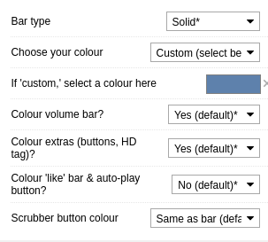

<h1 align="center">nordtube</h1>

  

## 💻 Installation

The only thing you need to have installed before trying to install nordtube is the [stylus](https://github.com/openstyles/stylus) browser extension

For now dark mode is **required** for the theme to work.

[Click here to install nordtube](https://github.com/sheeepdev/nordtube/raw/main/nordtube.user.css)

## 🎨 Recommended extensions and styles

🛡️ [SponsorBlock](https://sponsor.ajay.app/) | Blocks youtube sponsors, intros and more!

🖌️ [Custom Progress Bar](https://33kk.github.io/uso-archive/?style=95280) | Styles your youtube progress bar

⚙️ Recommended settings for Custom Progress Bar

## 👤 Author

🐏 **sheep**

* 🌐 Website: https://sheepdev.xyz
* 🐦 Twitter: [@imsheeeep](https://twitter.com/imsheeeep)
* 💻 GitHub: [@sheeepdev](https://github.com/sheeepdev)
* 💬 Discord: [sheep#2428](https://discord.com/users/429303151598895106) (Friend requests disabled, DM me elsewhere and ill add you)

## 🤝 Contributing

Contributions, issues and feature requests are welcome! Feel free to check [issues page](https://github.com/sheeepdev/nordtube/issues). 

## 🌟 Show your support

Give a ⭐️ if you like this project!

## 📝 Note

This is my **personal** theme, there may be some things that you won't like. You'll need to change that by yourself.
Colors are changable by editing the variables in the file.

## 📩 License

Copyright © 2021 [sheepdev](https://github.com/sheeepdev). 
This project is licensed under the [CC-BY-4.0](https://github.com/sheeepdev/nordtube/blob/main/LICENSE) license.
